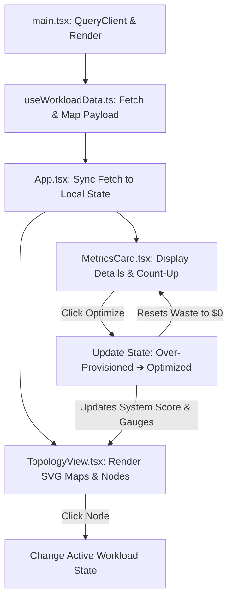

# Technical Challenge Submission Walkthrough
## Atomity Cloud Cost & Carbon Optimization Topology

This document provides a step-by-step walk-through of the submission, explaining the architecture, key implementation decisions, and core technical concepts. Use this as a reference guide during your technical interview.

---

## 🚀 1. The Approach: Step-by-Step

Here is how the application initializes, retrieves data, visualizes the cloud topology, and executes optimization logic in real-time.

### Step 1: Bootstrapping & Client Configuration
* **Where**: [main.tsx](file:///c:/Users/Anjali%20patel/OneDrive/Desktop/backend-projects/atomity-challenge/src/main.tsx)
* **What**: Initializes the React application and sets up the **TanStack React Query Client**.
* **Key Detail**: Queries are configured with `staleTime: 5 minutes` and `refetchOnWindowFocus: false`. Disabling refetch on focus ensures that when you tab away from the app and return, your local optimization state isn't overwritten by a background query refresh.

### Step 2: The Data Layer & Procedural Schema Mapping
* **Where**: [useWorkloadData.ts](file:///c:/Users/Anjali%20patel/OneDrive/Desktop/backend-projects/atomity-challenge/src/hooks/useWorkloadData.ts)
* **What**: Fetches data from a public REST API (`https://jsonplaceholder.typicode.com/todos`).
* **Processing**: 
  - To simulate network delay, a artificial timeout of **1200ms** is added.
  - The API payload is mapped into a structured `Workload` schema.
  - Categories (`aws`, `azure`, `gcp`, `on-premise`) and microservice names (`auth-api`, `payment-gateway`, etc.) are assigned procedurally.
  - The workload status is determined by the `completed` status of the todo item: `true` represents `optimized`, while `false` represents `over-provisioned`.
  - CPU/Memory allocation limits and estimated cost savings are generated procedurally based on the `todo.id` to ensure consistency.

### Step 3: Page Transitions & Local State Synchronization
* **Where**: [App.tsx](file:///c:/Users/Anjali%20patel/OneDrive/Desktop/backend-projects/atomity-challenge/src/App.tsx)
* **What**: Manages global orchestrator state.
  - **`showDashboard`**: Tracks if the user is on the landing page or the topology screen. The transition is wrapped in Framer Motion's `<AnimatePresence>` for spring-based page switching.
  - **`localWorkloads`**: Clones the query data into local component state. This allows the dashboard to modify individual nodes and update total cost/waste computations dynamically without database writes.
  - **`activeWorkload`**: Stores the workload currently highlighted in the map.

### Step 4: Drawing the Topology Canvas
* **Where**: [TopologyView.tsx](file:///c:/Users/Anjali%20patel/OneDrive/Desktop/backend-projects/atomity-challenge/src/components/TopologyView.tsx)
* **What**: Visualizes the system layout.
  - **Layout**: Features a 5-column grid layout (AWS & GCP left, Resource Core center, Azure & On-Premise right) on desktop, and a single-column layout on mobile.
  - **SVG Paths**: Curved Bezier lines link the outer cloud platforms to the center. They feature an animated dashed telemetry trail.
  - **Cloud Envelopes**: Built using a seven-sided polygon (Heptagon) backdrop.
  - **Workload Hexagons**: Custom-drawn SVG hexagons. They monitor their own metrics to render status borders: **red pulsing dot** for over-provisioned status, and a **steady green dot** for optimized status.

### Step 5: Metrics Analysis & Action Execution
* **Where**: [MetricsCard.tsx](file:///c:/Users/Anjali%20patel/OneDrive/Desktop/backend-projects/atomity-challenge/src/components/MetricsCard.tsx)
* **What**: Renders resource configuration details.
  - When the active node changes, the monthly savings value counts up smoothly from `$0` to the target amount in `800ms`.
  - Clicking **"Apply Right-sizing"** fires a callback that updates `localWorkloads` in [App.tsx](file:///c:/Users/Anjali%20patel/OneDrive/Desktop/backend-projects/atomity-challenge/src/App.tsx). This marks the node's status as `optimized`, sets estimated savings to `0`, updates global waste counters, and slides down the central core resource gauge bars.

---

## 🛠️ 2. Key Implementation Decisions

### Decision 1: Local State Cloning for Interactive Mutations
* **Problem**: We are fetching data from a public read-only mock endpoint, which does not support persistent state mutations.
* **Solution**: The dashboard synchronizes the initial query payload into a local React state variable (`localWorkloads`). Any user interaction (right-sizing workloads) is committed directly to this local array. This keeps the application fully functional, updating system gauges, saving counters, and node statuses instantly without requiring a backend database.

### Decision 2: Pure SVG Vector Architecture vs. Canvas Libraries
* **Problem**: Third-party diagramming frameworks (e.g., D3, GoJS) increase package weight and add styling boundaries.
* **Solution**: The topology is drawn using clean, native SVG coordinates. 
  - Standard SVG polygon coordinate grids shape the cloud frames.
  - Simple math calculations produce the hexagon coordinate vectors for workload nodes.
  - Native CSS properties drive the styling, ensuring that theme variables (light/dark mode) apply seamlessly to SVG fills and borders.

### Decision 3: Tailwind CSS v4 Native Compilation
* **Problem**: Tailwind v3 requires configuration files, build utilities, and PostCSS processes, adding friction.
* **Solution**: The project implements Tailwind CSS v4 using the Vite plugin (`@tailwindcss/vite`). Themes and configurations are declared directly inside [index.css](file:///c:/Users/Anjali%20patel/OneDrive/Desktop/backend-projects/atomity-challenge/src/index.css) using CSS variables and `@theme` blocks, resulting in faster compilation and zero configuration clutter.

### Decision 4: Custom Frame-Rate Based Counter
* **Problem**: Standard animation frameworks can struggle with precise numeric transitions or require heavy packages.
* **Solution**: Implemented a custom `setInterval` loop in [MetricsCard.tsx](file:///c:/Users/Anjali%20patel/OneDrive/Desktop/backend-projects/atomity-challenge/src/components/MetricsCard.tsx) calibrated to execute at 30 frames per second over 800ms. It calculates frame-by-frame increments, updating state and cleaning itself up on component unmount or workload change.

---

## 💡 3. Technical Concepts Explained

### 1. Asynchronous Data Management (`staleTime`)
Using React Query's cache model, the application keeps retrieved payloads in memory. The `staleTime` parameter determines how long data is considered fresh. During this period (5 minutes in our app), clicking workloads or refreshing layouts pulls data instantly from the local cache rather than making redundant network requests.

### 2. SVG Telemetry Path Tracing
The connection streams are animated using a stroke offset keyframe rule. SVG paths have a `stroke-dasharray` value that breaks the lines into dashes and spaces. By shifting the `stroke-dashoffset` value continuously in a CSS loop, the dashes slide along the curve, visually simulating data telemetry flow.

### 3. Responsive Container Queries
Typically, grids adapt to screen width (media queries). In our case, the metrics details inside the right-hand panel use **CSS Container Queries** (`@container`). By setting the parent wrapper container type to `inline-size`, the details layout splits into two columns only when the *Metrics Card container itself* is wider than `350px`, regardless of the overall viewport width.

### 4. Bouncing Springs (Physical Animations)
Instead of linear transitions, Framer Motion uses spring physics. Fading and sliding layouts adapt to mass, stiffness, and damping constants. This gives UI components a sense of physical weight and acceleration, aligning the dashboard with premium web design aesthetics.

### 5. Sovereign Accessibility Settings (`prefers-reduced-motion`)
The application respects user operating system options for reduced motion. By querying this preference using Framer Motion's `useReducedMotion` hook, the application automatically disables animations like sliding panels, floating elements, and dash keyframe loops. This ensures comfortable readability for users who experience motion sensitivities.
